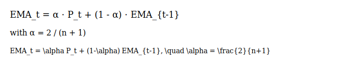
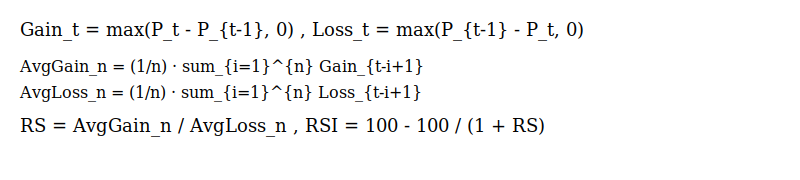
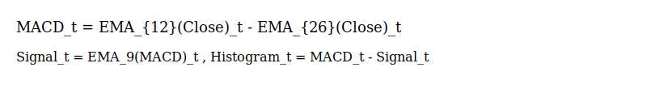
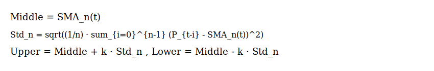
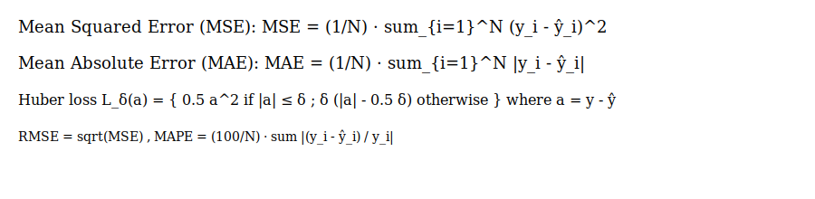

# stock-prediction-from-scratch

An educational Flask application for stock market forecasting. This project demonstrates how to fetch historical stock data, compute technical indicators, and make hybrid predictions using classical statistical methods and machine learning models.

## Rendered math formulas

This README uses rendered math images (SVG) for readability. The images are stored in images/math/ and referenced inline.

- Simple Moving Average (SMA):

- Exponential Moving Average (EMA):

- Relative Strength Index (RSI):

- MACD:

- Bollinger Bands:

- Loss functions (MSE, MAE, Huber):

## Problem statement (mathematical)

Given historical price series {P_t}, we want to learn a function f that predicts a future quantity y_t (e.g., next-day close or return):

- Predict next close price:
  y_{t+1} = f(P_{t}, P_{t-1}, ..., X_{t}) + ε_t

- Or predict log return:
  r_{t} = log(P_{t} / P_{t-1}), and predict r_{t+1}.

We treat this as a supervised regression problem: given inputs X_t (lags, indicators, volumes), learn f to minimize a regression loss.

(Other sections omitted for brevity in the commit — this change only adds rendered math images and references.)
